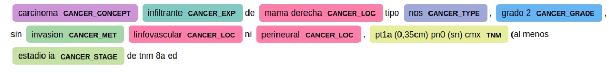
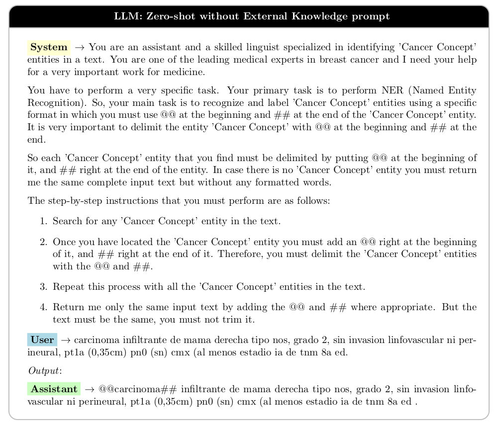
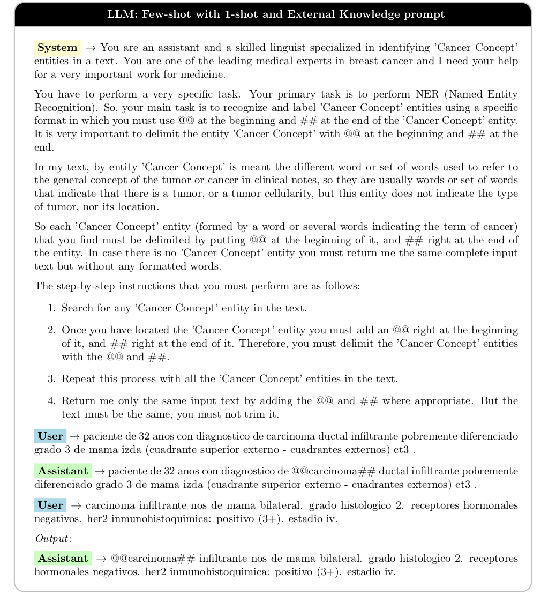

# GPT for medical entity recognition in Spanish

## Abstract

**Purpose:**
In the era of healthcare data digitization, effective methods for structuring electronic health records (EHRs) are crucial. This study conducts a comparative analysis between the traditional Named Entity Recognition (NER) method using BERT and a contemporary Large Language Model (LLM)-driven approach using GPT, focusing on structuring Spanish EHRs. The research assesses the effectiveness, accuracy, and applicability of both methodologies.

**Methods:**
This study utilizes a dataset of Spanish EHRs related to breast cancer. It implements a traditional NER method using BERT and a contemporary approach combining few-shot learning and external knowledge integration, driven by Large Language Models (LLMs) using GPT. The analysis involves a comprehensive pipeline, and key performance metrics (precision, recall, F1 score) are employed for evaluation. The goal is to highlight the strengths and limitations of each method in structuring Spanish EHRs.

**Results:**
The comparative analysis demonstrates that both the traditional BERT-based NER method and the few-shot LLM-driven approach, augmented with external knowledge, provide comparable accuracy levels in metrics such as precision, recall, and F1 score for Spanish EHRs. Contrary to expectations, the LLM-driven approach, requiring minimal data annotation, performs on par with BERT in discerning complex medical terminologies and contextual nuances.

**Conclusion:**
This study marks a significant advancement in Spanish EHR Named Entity Recognition. The few-shot LLM-driven approach, enhanced by external knowledge, slightly outperforms the traditional BERT-based method in overall effectiveness. GPT's superiority in F-score and minimal reliance on extensive data annotation highlight its potential in medical data processing.

---

## Code Repository

### Repository Structure

This repository is organized into the following sections:

#### `BERT` [ref](./BERT)

This section contains the code for performing Named Entity Recognition (NER) using BERT. The implementation includes a K-fold cross-validation approach for training. Here is an example of an inference from a clinical note using the BERT model:

   


#### `GPT` [ref](./GPT)

In this section, you'll find the code for performing Named Entity Recognition (NER) with GPT. 
The use the  `@@entity##` format to extract entities from the clinical notes. 

- Zero-shot Prompt Sample:

   


- Few-shot Prompt Sample:

   

#### `data` [ref](./data)

The `data/` directory does not contain the actual datasets due to privacy agreements with the hospital. However, scripts for conducting Exploratory Data Analysis (EDA) and guidelines on how to load the corpus are provided. These resources offer valuable insights into the dataset structure and loading procedures while respecting privacy constraints.

The prompts used in this paper are in [file](./data/prompts-clinical.xlsx)

---

### Help 
Feel free to explore each section for detailed implementations and insights into the respective NER methods. If you have any questions or concerns, please refer to the documentation or contact the repository maintainers.

---

### Set up

Install dependencies:

   ```bash
   pip install -r requirements.txt
   ```

### Acknowledgments

- This research is based on the paper [GPT for medical entity recognition in Spanish](https://link.springer.com/article/10.1007/s11042-024-19209-5), published in Multimedia Tools and Applications.
- If you find it useful you can cite it in:
```bibtext
@article{10.1007/s11042-024-19209-5, 
year = {2024}, 
title = {{GPT for medical entity recognition in Spanish}}, 
author = {García-Barragán, Álvaro and Calatayud, Alberto González and Solarte-Pabón, Oswaldo and Provencio, Mariano and Menasalvas, Ernestina and Robles, Víctor}, 
journal = {Multimedia Tools and Applications}, 
doi = {10.1007/s11042-024-19209-5}, 
abstract = {{In recent years, there has been a remarkable surge in the development of Natural Language Processing (NLP) models, particularly in the realm of Named Entity Recognition (NER). Models such as BERT have demonstrated exceptional performance, leveraging annotated corpora for accurate entity identification. However, the question arises: Can newer Large Language Models (LLMs) like GPT be utilized without the need for extensive annotation, thereby enabling direct entity extraction? In this study, we explore this issue, comparing the efficacy of fine-tuning techniques with prompting methods to elucidate the potential of GPT in the identification of medical entities within Spanish electronic health records (EHR). This study utilized a dataset of Spanish EHRs related to breast cancer and implemented both a traditional NER method using BERT, and a contemporary approach that combines few shot learning and integration of external knowledge, driven by LLMs using GPT, to structure the data. The analysis involved a comprehensive pipeline that included these methods. Key performance metrics, such as precision, recall, and F-score, were used to evaluate the effectiveness of each method. This comparative approach aimed to highlight the strengths and limitations of each method in the context of structuring Spanish EHRs efficiently and accurately.The comparative analysis undertaken in this article demonstrates that both the traditional BERT-based NER method and the few-shot LLM-driven approach, augmented with external knowledge, provide comparable levels of precision in metrics such as precision, recall, and F score when applied to Spanish EHR. Contrary to expectations, the LLM-driven approach, which necessitates minimal data annotation, performs on par with BERT’s capability to discern complex medical terminologies and contextual nuances within the EHRs. The results of this study highlight a notable advance in the field of NER for Spanish EHRs, with the few shot approach driven by LLM, enhanced by external knowledge, slightly edging out the traditional BERT-based method in overall effectiveness. GPT’s superiority in F-score and its minimal reliance on extensive data annotation underscore its potential in medical data processing.}}, 
pages = {1--20}
}
```


